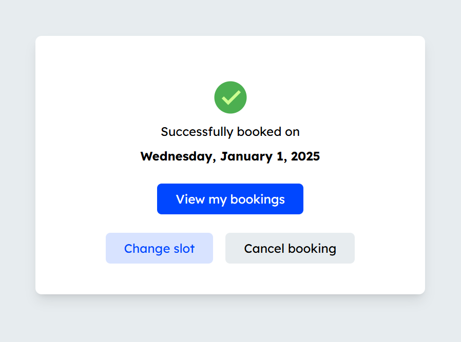

 
    <h1>📅 Book me</h1> 
    
<strong>A modern scheduling web application.</strong>
 
    
🚧 <em>Work in progress</em> 🚧
 
      
    
    
    
     

## 🔧 Tech Stack

| Framework / Library | Version  |
|---------------------|----------|
| Next.js             | 15.3.2   |
| React               | 19.0.0   |
| TypeScript          | 5.8.3    |
| Tailwind CSS        | 3.3.2    |
| tRPC                | 11.1.2   |
| Prisma              | 6.8.2    |

⚙
📄 License
MIT © Quentin Lathaud